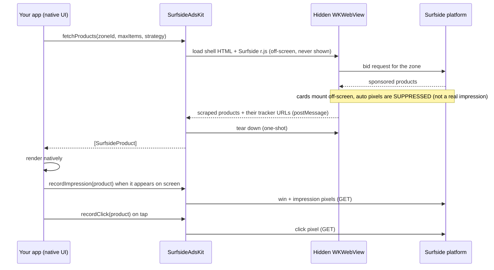

# SurfsideAdsKit

**A lightweight iOS package that delivers Surfside sponsored *product data* and banner placements to native apps, so you render commerce placements in your own UI while Surfside handles serving, decisioning, and measurement.**

SurfsideAdsKit is the iOS client edge of Surfside's commerce media platform. It has two surfaces:

- **Product fetch** (a data + tracking layer, not an ad UI): it fetches the sponsored products Surfside decides to serve for a placement and hands your app typed Swift values. Your team renders them natively (your components, your design system, your navigation) and tells the kit when a product is actually displayed or tapped, so measurement reflects real user exposure.
- **Banners** (`SurfsideBannerView` / `SurfsideBanner`): a visible, self-measuring banner view that shows whatever creative the zone serves, collapses itself on no-fill, and opens clickthroughs in an in-app Safari sheet.

Key properties:

- **No third-party dependencies**: Foundation + WebKit only. The Surfside iOS tracker is optional; when it is linked, AdsKit picks up its device identity automatically.
- **iOS 14+**, Swift 5.7+, async/await and completion-handler APIs.
- **Small surface area**: one type to construct, one call to fetch, one call each to record an impression and a click.

---

## Why it exists

Retailers and marketplaces want to monetize their owned iOS experiences with sponsored products, but they don't want an embedded web widget dictating their UI. SurfsideAdsKit separates the two concerns:

| Surfside owns | You own |
|---|---|
| Which products serve (decisioning, ranking, strategy) | How products look and lay out (native UI) |
| Win, impression, and click measurement (pixels) | When to fire them: `recordImpression` on display, `recordClick` on tap |
| Catalog data, pricing, sponsorship flags | Navigation and add-to-cart behavior |

The result: sophisticated, measurable retail media inside a fully native app, integrated in a few lines.

---

## How it works

Surfside's ad decisioning and measurement live in a JavaScript SDK (`r.js`). Rather than reimplement that logic natively (and drift out of sync with the platform), SurfsideAdsKit runs the real SDK in a **hidden, single-use `WKWebView`** purely as a data handshake, then scrapes the resulting product data (including each product's tracker URLs) back into Swift.



Key properties of this design:

- **The WebView is never visible and never in your view hierarchy.** The package creates it, drives one fetch, and tears it down. You render nothing from it. (It is briefly hosted off-screen in the app's window, because WebKit throttles un-windowed web content; see `headless` in [Configuration](#surfsideadsconfiguration).)
- **Measurement reflects real exposure.** An off-screen data-pump render is not a viewable impression, so the SDK's auto-fired win/impression pixels are suppressed during the fetch. The tracker URLs come back attached to each product, and your `recordImpression` call on real display is what counts, so numbers reconcile with what shoppers actually saw.
- **The requested count is deterministic.** The package sizes the placement so the SDK mounts exactly `min(maxItems, availableInventory)` products in a single pass: no viewport guesswork, no paging.

The banner surface is the opposite trade: the WebView **is** the UI, on screen, so nothing is suppressed or scraped. Its own pixels firing on display is a legitimate impression, and clickthrough is whatever the creative carries.

---

## Requirements

| | |
|---|---|
| Platform | iOS 14.0+ |
| Toolchain | Swift 5.7+ / Xcode 14+ |
| Dependencies | none (Foundation + WebKit; the Surfside iOS tracker is optional) |
| App Transport Security | Surfside hosts are HTTPS/ATS-compliant; no ATS exceptions required |

---

## Installation (Swift Package Manager)

**Xcode:** File ▸ Add Package Dependencies… ▸ enter `https://github.com/surfside-io/SurfsideAdsKit.git` ▸ Dependency Rule "Up to Next Major Version" from `1.0.0` ▸ add the **SurfsideAdsKit** product to your app target.

**`Package.swift`:**

```swift
dependencies: [
    .package(url: "https://github.com/surfside-io/SurfsideAdsKit.git", from: "1.0.0"),
],
targets: [
    .target(name: "YourApp", dependencies: ["SurfsideAdsKit"]),
]
```

Working on the SDK itself, or from a local clone? Use a local path instead:

```swift
.package(path: "../SurfsideAdsKit"),
```

The module and the package share the name: `import SurfsideAdsKit`.

---

## Quick start

```swift
import SurfsideAdsKit

// 1. Construct once with your placement identity.
let ads = SurfsideAds(
    accountId: "ec981",
    siteId: "544fa",
    channelId: "00000",
    locationId: "greengoddess"
)

// 2. Fetch products for a zone (async/await).
let products = try await ads.fetchProducts(zoneId: "6ambm", maxItems: 4, strategy: .hybrid)

// 3. Render them in YOUR UI, and report display + taps.
ForEach(products) { product in
    ProductCard(
        title: product.name,
        price: product.salePrice ?? product.price,
        imageURL: product.image.flatMap(URL.init(string:)),
        isSponsored: product.sponsored
    )
    .onAppear {
        ads.recordImpression(product)     // once, when it first appears on screen
    }
    .onTapGesture {
        ads.recordClick(product)          // fire the click pixel
        if let url = product.clickURL {   // then navigate; that part is yours
            open(url)
        }
    }
}
```

Prefer callbacks? The completion-handler variant is delivered on the main thread, exactly once:

```swift
ads.fetchProducts(zoneId: "6ambm", maxItems: 4) { result in
    switch result {
    case .success(let products): render(products)   // may be empty; see below
    case .failure(let error):    log(error)
    }
}
```

---

## Banners

For zones that serve display creatives rather than product data, drop in a banner view. It loads the web ads SDK on screen, shows the creative, collapses itself to zero height on no-fill, and opens a tapped clickthrough in an in-app `SFSafariViewController`.

**SwiftUI:**

```swift
SurfsideBanner(
    configuration: .init(accountId: "ec981", siteId: "544fa",
                         channelId: "00000", locationId: "greengoddess"),
    zoneId: "6ambm",
    size: CGSize(width: 8, height: 1),      // the zone's banner ratio: 8x1 here
    onLoad: { renderedSize in /* optional */ },
    onNoFill: { /* hide the row */ },
    onError: { error in log(error) }
)
.frame(width: 320, height: 40)              // lay it out at that ratio: 8x1 at 320pt wide
```

**UIKit:**

```swift
let banner = SurfsideBannerView(
    configuration: .init(accountId: "ec981", siteId: "544fa",
                         channelId: "00000", locationId: "greengoddess"),
    zoneId: "6ambm",
    size: CGSize(width: 4, height: 1)      // a 4x1 banner
)
banner.delegate = self                 // SurfsideBannerViewDelegate, all methods optional
stackView.addArrangedSubview(banner)   // auto-loads once it enters a window
banner.heightAnchor.constraint(equalTo: banner.widthAnchor, multiplier: 1.0 / 4.0).isActive = true
```

Banner semantics, in contrast to the product fetch:

- **`size` is the banner ratio, not a pixel box.** Surfside serves banners by aspect ratio (`8x1`, `4x1`, `2x1`), and `size` goes into the bid request as those two integers, so pass the ratio the zone is configured for. Lay the view out at whatever real size fits your screen at that ratio (an 8x1 banner at 320pt wide is 320×40; 4x1 is 320×80; 2x1 is 320×160). Once the creative renders, the view adopts its measured size and reports it through `onLoad` / `surfsideBannerViewDidLoad`.
- **Nothing is suppressed.** The banner is a real on-screen render, so the SDK's own win/impression pixels firing is correct measurement. There is no `recordImpression` to call for banners.
- **Load outcomes** surface via the delegate (or the SwiftUI closures): loaded (with the measured creative size when readable), no-fill (the view has already collapsed; treat it as normal), or a genuine error.
- **Loading is one-shot per view.** `autoLoad` (default `true`) loads on first entering a window; set it `false` and call `load()` to drive it manually. To reload, create a fresh view.

---

## API reference

### `SurfsideAds`

```swift
// Common initializer: the four placement IDs, sensible defaults for the rest.
init(accountId:siteId:channelId:locationId:)

// Full control (advanced knobs; see Configuration).
init(configuration: SurfsideAds.Configuration, urlSession: URLSession = .shared)

// Fetch: async and completion variants.
func fetchProducts(zoneId:maxItems:strategy:) async throws -> [SurfsideProduct]
func fetchProducts(zoneId:maxItems:strategy:completion: (Result<[SurfsideProduct], Error>) -> Void)

// Fire win + impression pixels when a product is actually displayed.
func recordImpression(_ product: SurfsideProduct, completion: ((Bool) -> Void)? = nil)

// Fire the click pixel when the shopper taps (navigation stays yours).
func recordClick(_ product: SurfsideProduct, completion: ((Bool) -> Void)? = nil)
```

- **`maxItems`** (default `10`): a hard ceiling on how many products come back.
- **`strategy`** (default `.hybrid`): `.sponsored` (paid only), `.recommended` (algorithmic only), or `.hybrid` (both).
- The pixel calls are fire-and-forget GETs; the optional completion reports `true` when every pixel completed without a transport error, delivered on an arbitrary queue.

### `SurfsideAds.Configuration`

For most integrations the four-ID initializer is enough. `Configuration` exposes advanced options:

| Field | Default | Purpose |
|---|---|---|
| `accountId`, `siteId`, `channelId`, `locationId` | required | Placement identity |
| `category`, `keywords` | `"all"`, `"product"` | Required by the SDK for a placement to serve |
| `rjsURL` | `//cdn.surfside.io/ads/2.0.0/r.js` | Pinned SDK bundle; override only to test another build |
| `baseURL` | `https://internalhost.com` | Synthetic https origin the shell loads under, so CSP/CORS behave |
| `requestTimeout` | `15` s | Deadline before a fetch fails with `.timeout` (see [Troubleshooting](#troubleshooting) before lowering it) |
| `userId` | `nil` | Explicit device-identity override; leave `nil` to auto-acquire from the tracker (see [Identity](#identity)) |
| `headless` | `false` | Run the fetch WebView un-windowed. Leave `false`: WebKit throttles un-windowed web content and fetches will time out |
| `isInspectable` | `false` | Attach Safari Web Inspector to the hidden WebView; **debug only** |

### `SurfsideProduct`

```swift
struct SurfsideProduct: Identifiable, Decodable, Equatable {
    let id: String                     // always present
    let name, price, salePrice: String?
    let image: String?                 // absolute CDN URL
    let brandName, productType: String?
    let thc, strain, cbd: String?
    let clickthroughURL: String?       // also available parsed, as `clickURL: URL?`
    let sponsored: Bool
    let ext: [String: String]?         // catalog extras (variants/sizes/keys)

    // Tracker URLs, fired for you by recordImpression / recordClick:
    let winTrackers: [String]?         // win-notice (nurl) pixels
    let impressionTrackers: [String]?  // impression pixels
    let viewableTrackers: [String]?    // reserved for a future recordViewable

    var clickURL: URL? { get }
    // winTrackerURLs / impressionTrackerURLs / viewableTrackerURLs: parsed variants
}
```

- Fields the platform emits as `"null"`/`""` are normalized to `nil` before they reach Swift, so an optional being `nil` always means "not present."
- A public memberwise initializer exists for tests and integrator-side mocking.
- You never fire tracker URLs yourself; pass the product to `recordImpression` / `recordClick`.

### `SurfsideBannerView` (UIKit) and `SurfsideBanner` (SwiftUI)

```swift
// UIKit
final class SurfsideBannerView: UIView {
    init(configuration: SurfsideAds.Configuration, zoneId: String, size: CGSize,
         delegate: SurfsideBannerViewDelegate? = nil)
    convenience init(accountId:siteId:channelId:locationId:zoneId:width:height:)
    weak var delegate: SurfsideBannerViewDelegate?
    var autoLoad: Bool          // default true: load on first entering a window
    func load()                 // idempotent; first call wins
}

protocol SurfsideBannerViewDelegate: AnyObject {   // all methods have no-op defaults
    func surfsideBannerViewDidLoad(_ bannerView: SurfsideBannerView, size: CGSize?)
    func surfsideBannerViewDidReceiveNoFill(_ bannerView: SurfsideBannerView)
    func surfsideBannerView(_ bannerView: SurfsideBannerView, didFailWithError error: SurfsideAdsError)
}

// SwiftUI wrapper over the same view
struct SurfsideBanner: UIViewRepresentable {
    init(configuration:zoneId:size:onLoad:onNoFill:onError:)
}
```

`SurfsideBannerStatus` (`filled(size:)` / `empty` / `timeout` / `loadFailed`) is the underlying load outcome; delegate callbacks are derived from it. `empty` is deliberately not an error: no-fill collapses the view and calls `didReceiveNoFill`, mirroring how the fetch path treats an empty array as success.

### Errors: `SurfsideAdsError`

| Case | Meaning |
|---|---|
| `.loadFailed(String)` | The underlying network/load failed |
| `.timeout` | No result before `requestTimeout` (bad IDs/zone, or r.js never loaded) |
| `.decodeFailed` | A malformed payload came back |

> **No-fill is not an error.** When a zone has nothing to serve, `fetchProducts` succeeds with an **empty array**. Handle it with `products.isEmpty`, not a `catch`: an empty ad slot is a normal outcome.

---

## Identity

Ad requests carry an anonymous, device-level first-party id so serving and measurement key off the same identity as tracked events. You normally configure **nothing**; the id resolves per fetch, in this order:

1. **Explicit override**: a non-empty `Configuration.userId`, if you set one.
2. **Auto-acquired from the Surfside iOS tracker**: when [surfside-ios-tracker](https://github.com/surfside-io/surfside-ios-tracker) (2.1.0+) is linked into the app, AdsKit reads the tracker's resolved device id (`domainUserId`) at fetch time. This happens over the Objective-C runtime, so AdsKit keeps zero dependencies and behaves the same whether or not the tracker is present.
3. **Anonymous**: neither available. The fetch still works; requests just carry no device identity.

However it resolves, the id is seeded as the same first-party cookie (`surfid.`) the Surfside web ad core reads, so an app using both SDKs gets consistent attribution across tracked events and ad requests with no wiring.

Notes:

- This is a **device-level id, not a person-level identity** (not a uid2). Person-level identity stays the tracker's job (`setUser`).
- Set `Configuration.userId` only to force a specific id or when the tracker is absent and you manage your own device id.
- If the tracker is linked but was never started, there is no id to read yet; the fetch proceeds anonymously.

---

## Measurement contract

The product-fetch path is **suppress-then-report**:

- **At fetch**, the hidden render's automatic win/impression pixels are suppressed (an off-screen render is not a viewable impression). Each product comes back carrying its tracker URLs instead.
- **On display**, call `recordImpression(product)` **once, when the product first appears on screen**. That fires its win + impression pixels and is what records the impression server-side. Products you fetched but never displayed are never counted.
- **On tap**, call `recordClick(product)`, then navigate to `product.clickURL` yourself. Keeping navigation in your hands means you control the in-app vs. external browser experience.
- Script-type impression trackers cannot be deferred and fire once at fetch; the per-product lists contain pixel-type trackers only, so nothing double-counts. Viewable trackers are captured on the product but not yet fired (a threshold-gated `recordViewable` is planned).

Banners measure themselves: an on-screen banner firing its own pixels **is** the impression, so there is nothing to suppress and nothing to call.

---

## Threading & lifecycle

- Both `fetchProducts` variants can be called from anywhere; the WebView work is marshaled to the main thread internally, and the completion handler is delivered on the main thread.
- Each fetch is **one-shot**: the package builds a fresh WebView, runs a single request, and tears it down (message handler removed, no retain cycle). There is no shared/long-lived WebView to manage.
- `SurfsideAds` itself is cheap to hold and reuse across placements.
- A `SurfsideBannerView` loads once; create a fresh view to reload. UIKit views and banner APIs are main-thread, as usual.

---

## Versioning

This package follows [Semantic Versioning](https://semver.org/). Tags are **bare semver with no `v` prefix** (`1.0.0`, not `v1.0.0`); SPM treats the two forms as unrelated version series, so pin against the bare form.

```swift
// Recommended: take patches and minors, never a breaking change unattended.
.package(url: "https://github.com/surfside-io/SurfsideAdsKit.git", from: "1.0.0"),
```

**1.0.0 is the first tagged release.** See [CHANGELOG.md](CHANGELOG.md) for what each release contains.

**Maintainers:** tag annotated releases from the merge commit on `main`, never from an unmerged branch:

```bash
git tag -a 1.0.0 -m "1.0.0: first tagged release"
git push origin 1.0.0
```

---

## Verifying your integration

The fastest loop is the sample app's **AdsKit Lab** tab ([surfside-ios-sample-app](https://github.com/surfside-io/surfside-ios-sample-app)), which exercises fetch, impressions, clicks, and banners against a live zone.

To inspect your own integration:

1. **Watch the hidden WebView.** Set `isInspectable: true` in a debug build, run on a simulator or device, and attach Safari ▸ Develop ▸ your device. You can see r.js load, the bid request, and the mounted cards.
2. **Watch the pixels.** Run through a proxy (Charles, Proxyman, mitmproxy) and confirm: no win/impression requests at fetch time, then the win + impression GETs when `recordImpression` fires, and the click GET on `recordClick`.
3. **Confirm identity.** With the tracker linked and started, the ad request URL carries the tracker's device id. Anonymous runs are valid too; see [Identity](#identity).

---

## Troubleshooting

**Every fetch times out**

- `headless: true` is the usual cause: WebKit throttles un-windowed web content, so the SDK's JS stalls. Leave `headless` at its default (`false`).
- Don't lower `requestTimeout` aggressively. The JS side has an 8s internal ceiling that only starts once r.js has loaded (a cold CDN fetch can take ~3s), so the Swift backstop needs real headroom above 8s; too tight and genuine no-fill misreports as `.timeout`.
- Check the four placement IDs and the zone id: a placement that can never serve mounts nothing, which surfaces as `.timeout`, not as an error message.

**Fetch succeeds but the array is empty**

That's no-fill, a normal outcome: the SDK ran and the zone had nothing to serve. Verify the zone has flights/inventory configured for your `category`/`keywords` (defaults `"all"`/`"product"`).

**Impressions don't reconcile with the platform**

Confirm you call `recordImpression` exactly once per product, on first display, and that you actually display what you fetch. Requesting more products than you show is fine (undisplayed products are simply never counted), but showing a product without calling `recordImpression` undercounts.

**Banner shows nothing**

No-fill collapses the view to zero height by design; implement `surfsideBannerViewDidReceiveNoFill` (or `onNoFill`) to hide the surrounding layout. If outcomes never arrive at all, the same timeout guidance as the fetch path applies.

**Requests carry no device id**

The tracker isn't linked, or it hasn't started yet at fetch time. See [Identity](#identity); anonymous fetches are functional, just unattributed.

**Live-path tests fail with WebKit networking errors**

Run them inside an app host (or the sample app), not a bare SwiftPM logic-test bundle; see [Testing](#testing).

---

## Testing

```bash
swift test    # from the package root
```

Unit tests cover payload decoding, null-normalization, the max-items width guarantee, banner shell + status parsing, impression suppression/firing, and identity resolution (cookie seeding and the explicit-vs-auto order). The WebView fetch path is integration-only (it needs a real app context with a bundle id) and ships as an env-gated test:

```bash
SURFSIDE_LIVE=1 xcodebuild test \
  -scheme SurfsideAdsKit \
  -destination 'platform=iOS Simulator,name=iPhone 16' \
  -only-testing:SurfsideAdsKitTests/LiveFetchIntegrationTests
```

> Note: run the live path inside an **app** (or the sample app's AdsKit Lab tab), not a bare SwiftPM logic-test bundle; the latter has no host bundle id, which prevents WebKit networking from configuring.

---

## Roadmap / known limitations

- **Viewability**: viewable-tracker URLs are captured on each product but not yet fired; a threshold-gated `recordViewable` is planned.
- **Layout**: v1 returns a single batch capped by `maxItems`. Paging and single-product-card modes are planned.

---

## Support

Contact your Surfside representative for account, site, channel, location, and zone IDs, and for integration review.

---

*SurfsideAdsKit is part of Surfside, an AI-powered commerce media operating system for building, operating, monetizing, and measuring personalized advertising and merchandising experiences.*
