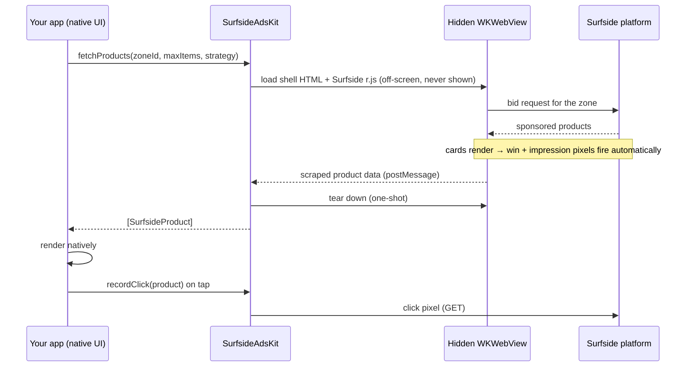

# SurfsideAdsKit

**A lightweight iOS package that delivers Surfside sponsored *product data* to native apps — so you render commerce placements in your own UI while Surfside handles serving, decisioning, and measurement.**

SurfsideAdsKit is the iOS client edge of Surfside's commerce media platform. It is a **data + tracking layer, not an ad UI**: it fetches the sponsored products Surfside decides to serve for a placement, fires the associated impression/win pixels, and hands your app typed Swift values. Your team renders them natively — your components, your design system, your navigation — with impression tracking preserved 1:1.

- **No third-party dependencies** — Foundation + WebKit only.
- **iOS 14+**, Swift 5.7+, async/await and completion-handler APIs.
- **Small surface area** — one type to construct, one call to fetch, one call to record a click.

---

## Why it exists

Retailers and marketplaces want to monetize their owned iOS experiences with sponsored products, but they don't want an embedded web widget dictating their UI. SurfsideAdsKit separates the two concerns:

| Surfside owns | You own |
|---|---|
| Which products serve (decisioning, ranking, strategy) | How products look and lay out (native UI) |
| Impression & win measurement (pixels) | Navigation and add-to-cart behavior |
| Catalog data, pricing, sponsorship flags | The tap target that calls `recordClick` |

The result: sophisticated, measurable retail media inside a fully native app, integrated in a few lines.

---

## How it works

Surfside's ad decisioning and measurement live in a JavaScript SDK (`r.js`) whose pixels fire **when a placement renders**. Rather than reimplement that logic natively (and drift out of sync with the platform), SurfsideAdsKit runs the real SDK in a **hidden, single-use `WKWebView`** purely as a data-and-tracking handshake, then scrapes the resulting product data back into Swift.



Key properties of this design:

- **The WebView is never visible and never in your view hierarchy.** The package creates it, drives one fetch, and tears it down. You render nothing from it.
- **Measurement stays authoritative.** Impression/win pixels fire from the same SDK the rest of Surfside uses, so counts reconcile with the platform — under the assumption that your app renders every product it receives (see [Measurement contract](#measurement-contract)).
- **The requested count is deterministic.** The package sizes the placement so the SDK mounts exactly `min(maxItems, availableInventory)` products in a single pass — no viewport guesswork, no paging. (`carouselWidth = (maxItems + 2) × cardWidth + 74`, which provably yields at least `maxItems` slots.)

---

## Requirements

| | |
|---|---|
| Platform | iOS 14.0+ |
| Toolchain | Swift 5.7+ / Xcode 14+ |
| Dependencies | none (Foundation + WebKit) |
| App Transport Security | Surfside hosts are HTTPS/ATS-compliant; no ATS exceptions required |

---

## Installation (Swift Package Manager)

**Xcode:** File ▸ Add Package Dependencies… ▸ enter the repository URL (or *Add Local…* during development) ▸ add the **SurfsideAdsKit** product to your app target.

**`Package.swift`:**

```swift
dependencies: [
    .package(url: "https://<your-git-host>/SurfsideAdsKit.git", from: "0.1.0"),
    // or, during local development:
    // .package(path: "../SurfsideAdsKit"),
],
targets: [
    .target(name: "YourApp", dependencies: ["SurfsideAdsKit"]),
]
```

---

## Quick start

```swift
import SurfsideAdsKit

// 1. Construct once with your placement identity.
let ads = SurfsideAds(
    accountId: "ec981",
    siteId: "544fa",
    channelId: "00000",
    locationId: "greengoddess"
)

// 2. Fetch products for a zone (async/await).
let products = try await ads.fetchProducts(zoneId: "6ambm", maxItems: 4, strategy: .hybrid)

// 3. Render them in YOUR UI.
ForEach(products) { product in
    ProductCard(
        title: product.name,
        price: product.salePrice ?? product.price,
        imageURL: product.image.flatMap(URL.init(string:)),
        isSponsored: product.sponsored
    )
    .onTapGesture {
        ads.recordClick(product)          // fire the click pixel
        if let url = product.clickURL {   // then navigate — your responsibility
            open(url)
        }
    }
}
```

Prefer callbacks? The completion-handler variant is delivered on the main thread, exactly once:

```swift
ads.fetchProducts(zoneId: "6ambm", maxItems: 4) { result in
    switch result {
    case .success(let products): render(products)   // may be empty — see below
    case .failure(let error):    log(error)
    }
}
```

---

## API reference

### `SurfsideAds`

```swift
// Common initializer — the four placement IDs, sensible defaults for the rest.
init(accountId:siteId:channelId:locationId:)

// Full control (advanced knobs — see Configuration).
init(configuration: SurfsideAds.Configuration, urlSession: URLSession = .shared)

// Fetch — async and completion variants.
func fetchProducts(zoneId:maxItems:strategy:) async throws -> [SurfsideProduct]
func fetchProducts(zoneId:maxItems:strategy:completion: (Result<[SurfsideProduct], Error>) -> Void)

// Record a click (fires the product's click pixel; fire-and-forget).
func recordClick(_ product: SurfsideProduct, completion: ((Bool) -> Void)? = nil)
```

- **`maxItems`** (default `10`) — a hard ceiling on how many products come back.
- **`strategy`** (default `.hybrid`) — `.sponsored` (paid only), `.recommended` (algorithmic only), or `.hybrid` (both).

### `SurfsideAds.Configuration`

For most integrations the four-ID initializer is enough. `Configuration` exposes advanced options:

| Field | Default | Purpose |
|---|---|---|
| `accountId`, `siteId`, `channelId`, `locationId` | — | Placement identity |
| `category`, `keywords` | `"all"`, `"product"` | Required by the SDK for a placement to serve |
| `rjsURL` | `//cdn.surfside.io/ads/2.0.0/r.js` | Pinned SDK bundle |
| `requestTimeout` | `12` s | Deadline before a fetch fails with `.timeout` |
| `isInspectable` | `false` | Attach Safari Web Inspector to the hidden WebView — **debug only** |

### `SurfsideProduct`

```swift
struct SurfsideProduct: Identifiable, Decodable, Equatable {
    let id: String                 // always present
    let name, price, salePrice: String?
    let image: String?             // absolute CDN URL
    let brandName, productType: String?
    let thc, strain, cbd: String?
    let clickthroughURL: String?   // also available parsed as `clickURL: URL?`
    let sponsored: Bool
    let ext: [String: String]?     // catalog extras (variants/sizes/keys)
    var clickURL: URL? { get }
}
```

Fields the platform emits as `"null"`/`""` are normalized to `nil` before they reach Swift, so an optional being `nil` always means "not present."

### Errors — `SurfsideAdsError`

| Case | Meaning |
|---|---|
| `.loadFailed(String)` | The underlying network/load failed |
| `.timeout` | No result before `requestTimeout` (bad IDs/zone, or no connectivity) |
| `.decodeFailed` | A malformed payload came back |

> **No-fill is not an error.** When a zone has nothing to serve, `fetchProducts` succeeds with an **empty array**. Handle it with `products.isEmpty`, not a `catch` — an empty ad slot is a normal outcome.

---

## Measurement contract

Impression and win pixels fire automatically when the hidden WebView renders the returned products. This gives accurate, platform-consistent counts **provided your app renders every product it receives**. If you fetch more than you display (e.g. request 10, show 3), the extra impressions are still counted. Request `maxItems` equal to what you will actually show.

Clicks are **not** automatic — call `recordClick(product)` when the shopper taps, then navigate to `product.clickURL` yourself. Keeping navigation in your hands means you control the in-app vs. external browser experience.

---

## Threading & lifecycle

- Both `fetchProducts` variants can be called from anywhere; the WebView work is marshaled to the main thread internally, and the completion handler is delivered on the main thread.
- Each fetch is **one-shot**: the package builds a fresh WebView, runs a single request, and tears it down (message handler removed, no retain cycle). There is no shared/long-lived WebView to manage.
- `SurfsideAds` itself is cheap to hold and reuse across placements.

---

## Testing

```bash
swift test    # from the package root
```

Unit tests cover payload decoding, the null-normalization, and the max-items width guarantee. The WebView fetch path is integration-only (it needs a real app context with a bundle id) and ships as an env-gated test:

```bash
SURFSIDE_LIVE=1 xcodebuild test \
  -scheme SurfsideAdsKit \
  -destination 'platform=iOS Simulator,name=iPhone 16' \
  -only-testing:SurfsideAdsKitTests/LiveFetchIntegrationTests
```

> Note: run the live path inside an **app** (or the sample app's AdsKit tab), not a bare SwiftPM logic-test bundle — the latter has no host bundle id, which prevents WebKit networking from configuring.

---

## Roadmap / known limitations

- **Identity** — in the anonymous WebView, per-device pixel macros (`fp_uid`, `deviceid`) are unfilled; geo resolves server-side. A future release bridges user / `surfId` from `surfside-ios-tracker` for cross-session attribution.
- **Layout** — v1 returns a single batch capped by `maxItems`. Paging and single-product-card modes are planned.

---

*SurfsideAdsKit is part of Surfside — an AI-powered commerce media operating system for building, operating, monetizing, and measuring personalized advertising and merchandising experiences.*
